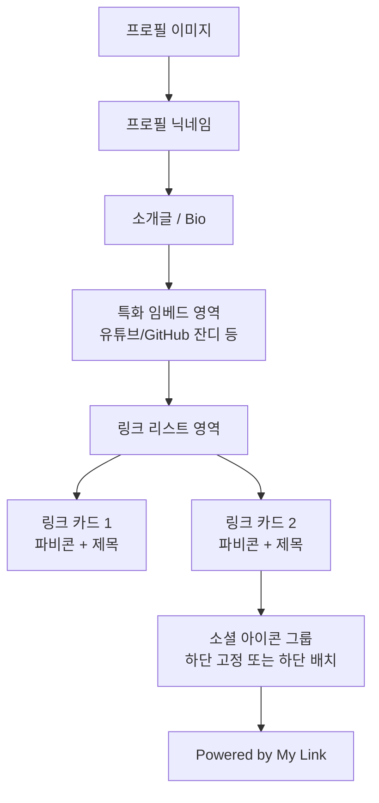

# 마이링크 (My Link) - 와이어프레임 (Wireframe)

본 문서는 **마이링크**의 주요 페이지 구성과 레이아웃 구조를 정의합니다. (기능 중심의 구조적 설계)

---

## 1. 관리자 대시보드 (Admin Dashboard)

사용자가 자신의 프로필과 링크를 관리하는 페이지입니다.

### 1.1. 레이아웃 구조 (상단 -> 하단)

1. **GNB (Global Navigation Bar)**:
    - 좌측: 서비스 로고 (My Link)
    - 우측: 사용자 프로필 아바타 & 로그아웃 버튼

2. **메인 섹션 (2-Column Layout 제안)**:
    - **좌측 (편집 영역)**:
        - **프로필 편집**: 이미지 업로드, 닉네임 수정, 한 줄 소개 입력.
        - **콘텐츠 임베드**: 유튜브 URL 또는 GitHub 아이디 입력 칸.
        - **링크 추가**: 큰 플러스(+) 버튼과 제목/URL 입력 필드.
        - **링크 리스트**: 제목, URL, 파비콘 아이콘이 포함된 카드 리스트. (삭제 버튼 포함)
    - **우측 (프리뷰 영역 - Mobile mockup)**:
        - 편집 중인 내용이 실시간으로 반영되는 스마트폰 모양의 프리뷰 창.

---

## 2. 유저 페이지 (Public Landing Page)

외부 방문자가 보게 되는 최종 결과 페이지입니다.

### 2.1. 레이아웃 구조 (수직형 단일 컬럼)

### 2.2. 주요 컴포넌트 상세 (shadcn/ui 활용)
- **Avatar**: 둥근 형태의 프로필 이미지 컴포넌트.
- **Button / Card**: 링크 카드는 그림자 효과가 있는 카드 형태 또는 투명한 테두리 버튼 형태 (디자인 시스템 적용).
- **Icons**: Lucide Icons와 파비콘 이미지를 혼합하여 사용.

---

## 3. UI/UX 요구사항 (핵심 포인트)

- **심플함**: 드래그 앤 드롭이나 복잡한 설정 없이도 충분히 아름다운 기본 레이아웃 제공.
- **접근성 (Accessibility)**: 고대비 및 폰트 크기 조절 등을 고려한 웹 접근성 준수.
- **반응형 (Responsive)**: 데스크톱보다는 모바일 환경(세로형)에서의 사용자 경험에 1순위 초점.
